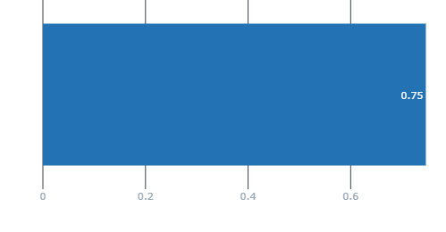
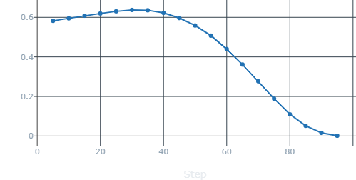
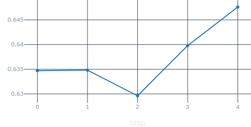

# Integrated MLOps Demo (Feature Engineering → Training → MLflow Registry → Serving → Monitoring)

This repo stitches your uploaded modules into **one runnable demo**:

* **Feature engineering** (quantile bucketization + hashing) → `data/processed/train.csv`, `test.csv`
* **Training**: XGBoost **LOW vs REST** classifier with **group-safe CV threshold selection**
* **MLflow**: logs runs + registers model as `sales-quantity-classifier` and sets alias `@production`
* **Serving**: FastAPI loads `models:/sales-quantity-classifier@production` and predicts on incoming rows
* **Monitoring**: simple KS-test drift checker vs baseline train data
* **Orchestration**: Prefect flow wires it all together

---

## 1) Quickstart (Docker Compose)

From the repo root:

```bash
docker compose up --build
```

* MLflow UI: [http://localhost:5000](http://localhost:5000)
* API health: [http://localhost:8000/health](http://localhost:8000/health)

> The API will return an error until a model is trained + registered (next step).

---

## 2) Run the full pipeline (Feature → Train → Evaluate → Register)

In another terminal (same repo):

```bash
docker compose run --rm api bash -lc "python -m pipelines.prefect_flow"
```

This will:

1. run feature engineering (writes `data/processed/*`)
2. train and log to MLflow
3. evaluate on test
4. register + set alias `@production`

Now the API `/health` should show `status=ok`.

---

## 3) Make a prediction

Example: send **one row** (schema matches `data/processed/train.csv` columns).

```bash
curl -X POST http://localhost:8000/predict \
  -H "Content-Type: application/json" \
  -d '{
    "rows": [{
      "QuantitySold": 12,
      "year": 2025, "month": 4, "day": 26, "dayofweek": 5, "is_weekend": 1,
      "h_item": 773, "h_branch": 113, "h_invoice": 2661,
      "h_item_branch": 3382, "h_item_month": 1930
    }]
  }'
```

Response:

* `low_risk`: 1 means **LOW** predicted (your positive class in this demo)
* `probability_low`: probability for LOW
* `threshold`: the threshold chosen by group-safe CV

---

## 4) Run drift monitoring

Compare a production CSV vs the training baseline:

```bash
python -m monitoring.data_drift_monitor --production data/processed/test.csv
```

(See `monitoring/data_drift_monitor.py` for options.)

---

## Folder map

* `src/`

  * `feature_engineering.py` (from your feature engineer module, with a programmatic wrapper)
  * `train.py`, `evaluate.py`, `register.py` (new glue code to match the Prefect contract)
* `pipelines/` (Prefect orchestration layer you uploaded)
* `serving/` (FastAPI app)
* `monitoring/` (drift checker)
* `data/` (copied from your feature engineering zip)

---

## Results

| Metric           | Description                                               | Plot                                               |
| ---------------- | --------------------------------------------------------- | -------------------------------------------------- |
| Training F1      | Final F1 score on training data at selected threshold     |                      |
| Threshold Sweep  | Mean CV F1 score across tested thresholds                 |       |
| Fold Performance | Best-threshold F1 per CV fold                             |  |
| Test Mean        | Mean predicted probability on test set                    |          |
| Test Std         | Standard deviation of predicted probabilities on test set |           |

## Notes / Contracts (important)

* **No leakage**: `QuantitySold` is used only to build *past-only* lag/rolling features.
* **Group safety**: CV uses `h_item_branch` as the group key.
* **Serving**: for the demo, the API builds lag features using the stored train history as “past context”.

  * In a real product you’d store per-group history (feature store) and compute features online.
